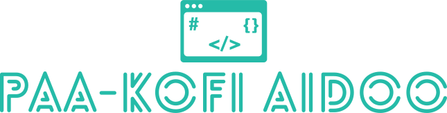

<br>

<h5 align="center">
    <code>
        <a href="https://www.paakofiaidoo.tech" title="My Portfolio"></a>
    </code>
    <code>
        <a href="https://www.linkedin.com/in/paakofiaidoo" title="LinkedIn Profile"> </a>
    </code>
</h5>
<br>

<div>

## Who am I ?

<br>

😎 Web developer, Electronics hobbyist

📅 22 years

⚒️ I live for the pursuit of knowledge

🏫 BSc Physics (electronics option) 4th year undergrad, KNUST, Kumasi, Ghana

😍 Coding, Philosophy (Ontology and Epistemology), Movies & Animations, Gaming

📨 contact me on paakofiaidoo17@gmail.com

</div>

<br>


<div>

<br>

## What i am learning topics for this year ?

<br>

```diff
+ Java using [jmix platform](http://jmix.io/) =>                                    30% [###=======]

+ Firebase =>                                                                       10% [#=========]

+ WordPress =>                                                                       0% [==========]

+ xstate =>                                                                         20% [##========]

+ vscode extension =>                                                                0% [==========]

+ postgres =>                                                                       40% [####======]

+ Advance programing concepts( algorithms, data structures, design patterns) =>      0% [==========]

+ Rust =>                                                                           10% [#=========]

+ TypeScript =>                                                                     10% [#=========]
```

</div>

<br><br>

## Projects I am working on for this year ?

<br>

<div >
    <a href="https://github.com/paakofiaidoo/juki-svelte" title="juki-svelte">
        
    </a>
    <a href="https://github.com/paakofiaidoo/CI-CD-samples" title="CI-CD-samples">
        
    </a>
</div>
